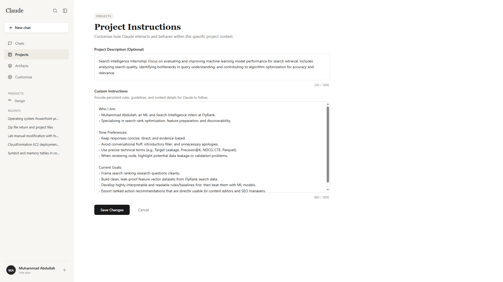
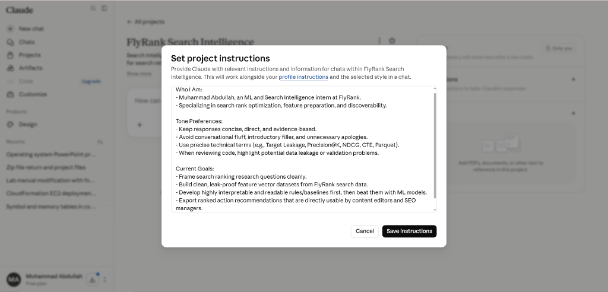

# AI Workflow Audit & Tool Setup (FL-01)

**Candidate/Intern:** Muhammad Abdullah (ML & Search Intelligence Intern)  
**Course:** AI Fluency: Framework & Foundations (Anthropic Academy)  
**Topic:** Task Classification, Claude Custom Instructions, and Success Definitions  

---

## 1. Introduction: The "AI Intern" Framework

Following the mental model proposed by Ethan Mollick in *On-boarding your AI Intern*, generative AI is treated not merely as static software, but as a capable, highly educated, yet occasionally error-prone assistant—like a gifted intern. To work effectively, we must:
1. **Understand boundaries:** Map out where AI speeds up tasks versus where it introduces risks (e.g. hallucinations, data leaks).
2. **Classify workflows:** Systematically group our recurring activities to decide when to automate, when to collaborate, and when to keep tasks purely human.

---

## 2. AI Workflow Audit

The following table audits 12 recurring tasks from a typical week in my study, work, and search intelligence research, classifying each according to the Mollick framework.

| # | Recurring Task | Classification | One-Line Rationale |
|---|---|---|---|
| 1 | **Writing weekly status update emails to my mentor** | **Just Me** | Direct personal updates are essential for building a genuine professional relationship and must maintain my unique voice. |
| 2 | **Studying video lectures/tutorials for new ML concepts** | **Just Me** | True conceptual learning and comprehension require my focused cognitive attention; outsourcing the consumption phase defeats the educational purpose. |
| 3 | **Conducting exploratory data analysis (EDA) presentations with business stakeholders** | **Just Me** | Real-time stakeholder communication requires high empathy, verbal adaptability, and immediate business context that AI cannot replicate. |
| 4 | **Writing Python unit tests for data cleaning/feature pipelines** | **Delegate to AI with Review** | Writing boilerplate test structures is highly repetitive and easily handled by AI, but I must execute and review the test cases for edge-case correctness. |
| 5 | **Translating legacy SQL queries to DuckDB syntax** | **Delegate to AI with Review** | Dialect translation is a mechanical task where AI excels, but I must run the query on sample data to verify output parity. |
| 6 | **Drafting SEO-optimized page titles and meta descriptions** | **Delegate to AI with Review** | AI can rapidly generate multiple creative metadata variations, leaving me to curate, edit, and ensure alignment with the brand guidelines. |
| 7 | **Brainstorming feature engineering ideas for search ranking models** | **Collaborate with AI** | An iterative back-and-forth helps generate creative feature candidates (e.g., combinations of CTR, bounce rates, and freshness), which I then filter for leakage. |
| 8 | **Debugging obscure Python runtime or library package errors** | **Collaborate with AI** | Explaining stack traces to AI yields rapid troubleshooting hypotheses, but fixing them requires my local system context and execution. |
| 9 | **Reading and summarizing dense search ranking research papers** | **Collaborate with AI** | I use AI to extract core mathematical abstractions and terminology, then manually cross-reference them with our project docs to ensure correct understanding. |
| 10 | **Formatting and linting markdown documentation or READMEs** | **Fully Automate** | Mechanical formatting standards can be checked and applied automatically via pre-commit hooks and CI scripts without manual intervention. |
| 11 | **Regenerating monthly performance reports from structured csv files** | **Fully Automate** | Python scripts scheduled via cron can pull data, compute standard metrics, and output PDF reports autonomously. |
| 12 | **Running periodic data leakage audits on training splits** | **Fully Automate** | Automated assertions in the training pipeline can block execution if future timestamps or label information bleed into the training split. |

---

## 3. Claude Project Custom Instructions

To ensure high-quality, aligned assistance for tasks related to our search ranking project, I have configured a Claude Project with the following custom instructions:

### Who I Am
```text
I am an ML and Search Intelligence intern at FlyRank, working on applied search intelligence, ranking models, and search discoverability. I develop data pipelines and models using a sample CSV dataset (~30k rows) and the full release (~79M rows) hosted on Hugging Face (internship-warehouse). My work involves feature preparation, baseline hand-rules, and machine learning models to improve Google search visibility.
```

### Tone Preferences
```text
- Keep responses concise, direct, and evidence-based. 
- Avoid conversational fluff, introductory filler (e.g., "Certainly! I can help you with...", "Here is the code..."), and unnecessary apologies.
- Use precise technical terms (e.g., Target Leakage, Precision@K, NDCG, CTE, Parquet).
- When reviewing code, highlight potential data leakage or validation problems. Be honest about model performance limits.
```

### Current Goals
```text
- Frame the search ranking research questions cleanly.
- Build clean, leak-proof feature vector datasets from FlyRank search data.
- Develop highly interpretable and readable rules/baselines first, then beat them with ML models.
- Export ranked action recommendations that are directly usable by content editors and SEO managers.
```

### Setup Screenshots
Below are the screenshots of the configured Claude Project interface and custom instructions:

**1. Claude Project Dashboard View**


**2. Custom Instructions Configuration Modal**


---

## 4. Target Tasks & Success Definitions (FL-02 through FL-04)

I have selected three specific tasks from my audit table to reuse in the upcoming fluency modules (**FL-02** through **FL-04**). The success definitions are structured to be specific and measurable.

### Target Task 1: Drafting SEO-Optimized Metadata (Titles & Meta Descriptions)
*   **Context:** Writing clean title tags and meta descriptions for pages flagged by our search ranking models.
*   **What "Done Well" Means (Success Definition):**
    1.  **Length Constraints:** Titles must strictly fit within 50–60 characters (pixel width <= 600px); meta descriptions must fit within 150–160 characters (pixel width <= 960px) to prevent truncation in SERPs.
    2.  **Semantic Relevance:** Must include the primary target keyword naturally in the first 30 characters of the title and within the meta description.
    3.  **Actionability (CTR):** Must contain a clear call-to-action (CTA) or search intent match (e.g. guide, buy, learn) to maximize click-through rate.
    4.  **Uniqueness:** 0% overlap with existing metadata across the rest of the site's domains to avoid duplicate content penalties.

### Target Task 2: SQL Dialect Translation (Legacy SQL to DuckDB)
*   **Context:** Migrating analytical queries and feature aggregation functions from legacy SQL (like BigQuery or PostgreSQL) to local DuckDB.
*   **What "Done Well" Means (Success Definition):**
    1.  **Syntactic Validity:** Runs in the target DuckDB environment without errors.
    2.  **Output Parity:** The row count, schema columns, and aggregate summaries (e.g., sum, mean, count) match the original legacy query exactly (100% data parity on a test split).
    3.  **Performance Efficiency:** Query utilizes DuckDB's vectorized execution engine (e.g., avoiding row-by-row scans, using appropriate CTEs, and loading directly from parquet files).
    4.  **Readability:** Adheres to standard SQL formatting (lowercase keywords, clear CTE indentation, descriptive aliases).

### Target Task 3: Writing Python Unit Tests for Feature Pipelines
*   **Context:** Creating pytest unit tests to safeguard data preparation and feature engineering modules against regressions.
*   **What "Done Well" Means (Success Definition):**
    1.  **Coverage Goal:** Reaches >= 90% statement coverage for target data-cleaning files, ensuring all conditional branching logic is tested.
    2.  **Edge Case Coverage:** Explicit tests exist for common data failures: null/NaN values, empty dataframes, mismatched column counts, and duplicate rows.
    3.  **Mocking & Isolation:** External resources (e.g., HF data downloads, DuckDB files) must be fully mocked or run using temporary paths (`tmp_path`) so that tests are deterministic, run offline, and complete in < 5 seconds.
    4.  **Assertion Quality:** Every test contains at least one descriptive assertion that validates both positive and negative bounds.

---

## 5. Tool Setup & Academy Enrollment Evidence

All tools within the free toolkit are set up and configured:
1.  **Claude Free Account:** Active and configured with the `claude_project_setup` custom instructions shown above.
2.  **ChatGPT Free Account:** Set up and used as the secondary cross-checking model.
3.  **Anthropic Academy Account:** Completed registration at `academy.anthropic.com`.
4.  **AI Fluency Course Enrollment:** Enrolled in **AI Fluency: Framework & Foundations**.
    - **Status:** Module 1 (*Core Concepts & Prompting Foundations*) completed.
    - **Key Learnings:** Learned the importance of system prompts, context windows, and structural formatting (xml tags) to guide LLM reasoning, as well as the Ethan Mollick task delegation framework.
