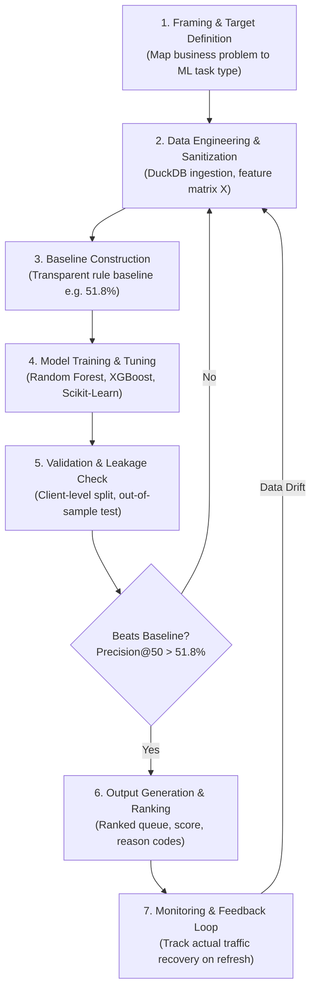

# ML Task Framing & Foundations: Search Intelligence Capstone

**Author:** Muhammad Abdullah (ML & Search Intelligence Intern)  
**Track:** Applied Search Intelligence (FlyRank)  
**Date:** July 21, 2026  
**Location:** Lahore, Pakistan  
**Repository Path:** `FlyRank/Week-02/Task-05`  

---

## 1. When Rules Beat Machine Learning (and Vice Versa)

Machine learning is not a default solution; it is a statistical trade-off. Simple, deterministic rules are superior to machine learning when business logic is clear, data volume is low, and deterministic predictability is mandatory. Machine learning is required only when the mapping between inputs and outputs involves complex, high-dimensional non-linear interactions that break manual rule maintenance.

```
+-----------------------------------------------------------------------+
|                         PROBLEM COMPLEXITY                            |
|                                                                       |
| Low Complexity / High Determinism      High Complexity / Pattern-Driven|
| +-------------------------------+      +----------------------------+ |
| |       USE PLAIN RULES         |      |    USE MACHINE LEARNING    | |
| |                               |      |                            | |
| | • Clear regulatory logic      |      | • High-dimensional inputs  | |
| | • Simple thresholds (age>180) | ---> | • Non-linear feature joins | |
| | • Zero training data needed   |      | • Continuous distribution  | |
| | • Instant deterministic audit |      | • Evolving search dynamics | |
| +-------------------------------+      +----------------------------+ |
+-----------------------------------------------------------------------+
```

### 1.1 When a Plain Rule is Better

A plain rule (e.g., `IF days_since_last_update > 180 AND organic_clicks_30d < 50 THEN flag_for_review`) is better under five specific engineering conditions:

1. **Deterministic Logic:** The business requirement has zero tolerance for probabilistic variance (e.g., tax calculation, GDPR deletion requests, user access permissions).
2. **Low Dimensionality:** The decision relies on 1 to 3 well-defined threshold variables.
3. **Cold-Start / Zero Training Data:** There are no historical ground-truth labels available to train a model.
4. **Instant Auditability:** Stakeholders require human-readable logic where every decision path can be traced line-by-line without feature importance approximation algorithms (e.g., SHAP).
5. **Zero Infrastructure Overhead:** Rules run in standard SQL or application code (`O(1)` time complexity) without pipeline training, feature store latency, model serialization, or data drift monitoring.

### 1.2 When Machine Learning is Required

Machine learning becomes necessary when plain rules fail due to structural data scale and non-linear complexity:

1. **High-Dimensional Feature Spaces:** Evaluating content refresh priority involves combining 44+ raw features simultaneously—impressions, clicks, average position, click-through rate (CTR) expected vs. actual, internal link count, query breadth, and seasonality.
2. **Fuzzy & Interacting Boundaries:** A page with 100 clicks that dropped 10% in impressions might be higher priority than a page with 10 clicks that dropped 50%. Plain rules collapse into an unmaintainable "spaghetti" of nested `IF-ELSE` statements trying to model these non-linear edge cases.
3. **Distribution Shift:** Search engine algorithms update constantly. Manual threshold rules break or become stale, whereas an ML pipeline retrains on updated feature snapshots without manual code rewriting.
4. **Ranking & Prioritization at Scale:** Rules classify pages into binary buckets (`decay` vs. `not decay`). They cannot produce a calibrated, continuous ranking score to order 30,000 pages when an editorial team can only process 50 pages per week.

### 1.3 Trade-Off Comparison Matrix

| Dimension | Plain Rule System | Machine Learning System |
| :--- | :--- | :--- |
| **Logic Source** | Explicit human engineering (hardcoded heuristics) | Inferred statistical parameters from training data |
| **Maintenance** | High friction as edge cases multiply | Automated retraining pipelines; monitoring data drift |
| **Interpretability** | 100% deterministic (clear `IF-THEN` path) | Probabilistic outputs; requires feature importance explanation |
| **Execution Cost** | Minimal CPU / SQL execution | Training compute, vectorization, inference latency |
| **Handling Noise** | Rigid; fails on unexpected outliers | Flexible; generalizes across noisy distributions |
| **Output Type** | Discrete boolean / categorical flags | Continuous probability, regression score, or ranking order |

---

## 2. Core Taxonomy: AI vs. ML vs. Analytics vs. Rules

To select the correct technical approach, we disambiguate the four primary paradigms used in data engineering and search intelligence systems.

```
+----------------------------------------------------------------+
| ARTIFICIAL INTELLIGENCE (Broad Paradigm)                       |
|  Computational systems mimicking cognitive decision-making     |
|                                                                |
|  +----------------------------------------------------------+  |
|  | MACHINE LEARNING (Statistical Subset)                    |  |
|  |  Algorithms learning patterns directly from data         |  |
|  |                                                          |  |
|  |  +----------------------------------------------------+  |  |
|  |  | SUPERVISED SCORING / RANKING (Our Capstone Task)  |  |  |
|  |  +----------------------------------------------------+  |  |
|  +----------------------------------------------------------+  |
|                                                                |
|  +-------------------------+      +-------------------------+  |
|  | RULE-BASED SYSTEMS      |      | DATA ANALYTICS / BI     |  |
|  | Explicit expert logic   |      | Historical aggregation  |  |
|  +-------------------------+      +-------------------------+  |
+----------------------------------------------------------------+
```

### 2.1 Definitions and System Boundaries

1. **Artificial Intelligence (AI):** The overarching academic and applied umbrella field focused on building systems capable of performing tasks that normally require human intelligence (e.g., search heuristics, expert knowledge graphs, natural language processing, autonomous navigation, and machine learning).
2. **Machine Learning (ML):** A statistical subfield of AI. Instead of programming explicit decision rules, ML algorithms optimize parameters on historical dataset $X$ to learn a general mapping function $f(X) \rightarrow y$ that predicts outcomes on previously unseen inputs.
3. **Data Analytics / Business Intelligence (BI):** The process of querying, aggregating, and visualizing historical data to answer *"What happened?"* and *"Why did it happen?"* (e.g., SQL aggregation of monthly click totals, DuckDB summaries). Analytics provides descriptive insight but does not automatically construct predictive scoring models for unseen pages.
4. **Rule-Based Systems:** Expert systems operating on hand-crafted conditional rules written by domain specialists. They do not learn from data or adapt parameters automatically.

### 2.2 Functional Comparison Matrix

| System Type | Input | Mechanism | Output | Example in Search Intelligence |
| :--- | :--- | :--- | :--- | :--- |
| **Rule-Based** | Raw page metrics | Manual `IF-THEN` conditional code | Binary Flag (`TRUE`/`FALSE`) | `IF days_old > 180 THEN refresh` |
| **Analytics / BI** | Historical logs | SQL `GROUP BY`, aggregation, filtering | Historical summary tables & charts | 30-day click decay total per domain |
| **Machine Learning** | Multi-column feature matrix | Mathematical optimization (e.g., Random Forest) | Continuous opportunity score (0.0 to 1.0) | Probability of traffic recovery post-refresh |
| **AI (LLM / Agent)**| Unstructured query / document | Neural attention layers / multi-step planning | Generated text analysis / refresh brief | Auto-generated article update outline |

---

## 3. The Machine Learning Lifecycle (The ML Loop)

Machine learning is an iterative engineering loop, not a linear execution script. A complete ML deployment requires continuous feedback between business requirements, feature engineering, model optimization, and post-deployment monitoring.



### 3.1 The 7 Stages of the Loop

1. **Framing & Target Definition:** Define the exact decision the business needs to make. Map the search question onto an ML task type (Scoring & Ranking) and establish defended success metrics (Precision@50).
2. **Data Pipeline & Sanitization:** Ingest raw multi-client warehouse data (DuckDB / Parquet). Perform missing value imputation, numeric scaling, categorical encoding, and feature extraction while strictly excluding target labels.
3. **Baseline Construction:** Build the simplest possible benchmark (random ranker or 180-day rule) before running complex models. Any ML model must justify its operational complexity by outperforming this baseline.
4. **Model Training & Hyperparameter Tuning:** Fit algorithms (e.g., Logistic Regression, Random Forest, Gradient Boosted Trees) on the training set to minimize objective loss.
5. **Validation & Leakage Audit:** Evaluate model performance on a strictly held-out test set split by **Client ID** (not page rows) to verify true generalization and confirm no future target signals leaked into features.
6. **Ranked Output & Recommendation Queue:** Blend model scores with business constraints to export a final, actionable CSV queue containing page identifiers, predicted decay probability, rank order, and feature reason codes.
7. **Production Monitoring & Retraining:** Track real-world post-refresh traffic recovery over 30/60/90-day windows. Feed outcomes back into the training snapshot to correct model drift.

---

## 4. Learning Paradigms: Supervised vs. Unsupervised

The choice between supervised and unsupervised learning determines how data is structured and evaluated.

```
+--------------------------------------------------------------------+
|                      LEARNING PARADIGMS                            |
|                                                                    |
| SUPERVISED LEARNING                   UNSUPERVISED LEARNING        |
| Features (X) + Ground Truth (y)       Features (X) ONLY (No y)     |
|                                                                    |
|  +---------------------------+         +-------------------------+ |
|  | Task: Map X -> y          |         | Task: Structure / Group | |
|  | Outcome: Predict label    |         | Outcome: Discover shapes| |
|  | Evaluation: Precision/F1  |         | Evaluation: Silhouette  | |
|  +---------------------------+         +-------------------------+ |
|                                                                    |
|  Example:                             Example:                     |
|  Predicting if page traffic           Grouping 30,000 pages into   |
|  will decline (decay = 1/0).          content archetypes by length |
|                                       and impression profile.      |
+--------------------------------------------------------------------+
```

### 4.1 Supervised Learning

* **Definition:** The algorithm is trained on a dataset of feature vectors paired with explicit historical labels: $\mathcal{D} = \{(x_1, y_1), (x_2, y_2), \dots, (x_n, y_n)\}$. The goal is to minimize prediction error on $y$.
* **Task Subtypes:**
  * **Classification:** Predicting discrete categories (e.g., `decay` vs. `stable`).
  * **Regression / Scoring:** Predicting a continuous numeric value (e.g., `predicted_click_loss_30d`).
  * **Learning to Rank:** Ordering items by pairwise or listwise relevance score.
* **Requirement:** Requires high-quality, leak-free historical labels $y$.

### 4.2 Unsupervised Learning

* **Definition:** The algorithm processes feature vectors without target labels: $\mathcal{D} = \{x_1, x_2, \dots, x_n\}$. The goal is to discover latent structures, clusters, or representations in the data space.
* **Task Subtypes:**
  * **Clustering:** Grouping similar pages based on structural attributes (e.g., K-Means, DBSCAN).
  * **Dimensionality Reduction:** Compressing high-dimensional feature spaces for visual analysis (e.g., PCA, UMAP).
* **Requirement:** Does not require ground-truth labels, but evaluation relies on geometric heuristics (e.g., Silhouette score) rather than business outcome metrics.

### 4.3 Practical Trade-off in Search Intelligence

For content refresh prioritization, **Supervised Learning (Scoring & Ranking)** is the correct choice because editorial teams require a definitive answer to a targeted question: *"Which specific 50 pages are suffering true search traffic decay and will yield maximum traffic recovery if updated?"* 

Unsupervised clustering can group pages by structural similarities (e.g., "short-form blog posts with low impressions"), but it cannot tell editors which cluster is actively losing traffic without supervised label overlay.

---

## 5. Generalization vs. Overfitting (Why Memorization Fails)

In machine learning, training accuracy is a false indicator of success. A model that achieves 100% accuracy on training data has frequently memorized noise and specific client quirks rather than learning generalized search performance signals.

```
+------------------------------------------------------------------+
|                     OVERFITTING VS GENERALIZATION                |
|                                                                  |
|   HIGH BIAS (Underfitting)     OPTIMAL GENERALIZATION            |
|   Single rigid threshold        Learns underlying curve          |
|   (Accuracy: 52%)               (Test Precision@50: 74%)         |
|                                                                  |
|   HIGH VARIANCE (Overfitting)                                    |
|   Memorizes training rows / client-specific artifacts           |
|   (Train Precision@50: 99%  --->  Test Precision@50: 48%)       |
+------------------------------------------------------------------+
```

### 5.1 Overfitting Mechanics

Overfitting occurs when a model fits noisy variations or non-predictive artifacts present in the training set. Common causes in search intelligence data include:

1. **Client ID Memorization:** The model learns that `client_id == 42` had high decay in May 2026 and assigns high decay risk to all pages from Client 42, regardless of individual page performance.
2. **Temporal Leakage:** Features contain future information derived from the label evaluation window (e.g., including post-decline impression counts).
3. **Excessive Tree Depth:** Decision trees splitting down to single-leaf samples, effectively creating a lookup table of historical rows.

### 5.2 Generalization and Out-of-Sample Validation

Generalization is the capability of a trained model to maintain high prediction precision on previously unseen data drawn from the same underlying probability distribution.

To guarantee generalization:
* **Train / Test Split Ratio:** 80% training data, 20% held-out test data.
* **Client-Level Holdout Strategy:** Random row splits cause **data leakage** because pages from the same domain share identical domain authority, hosting infrastructure, and publishing templates. If 80% of Client A's pages are in train and 20% in test, the model memorizes Client A's specific baseline performance.
* **Execution Rule:** Hold out entire **clients** (domains) in the test set. The model is evaluated strictly on clients it has never seen during training.

```
+-------------------------------------------------------------------+
| CLIENT-LEVEL SPLIT STRATEGY (Leakage Prevention)                  |
|                                                                   |
| WRONG: Random Row Split (Data Leakage)                            |
| [ Client A - Page 1 ] -> Train     [ Client A - Page 2 ] -> Test   |
| (Model memorizes Client A baseline -> Test score is artificially inflated) |
|                                                                   |
| CORRECT: Client Holdout Split (True Generalization Test)           |
| [ Client A (all 5,000 pages) ] -> TRAIN SET                        |
| [ Client B (all 4,000 pages) ] -> TRAIN SET                        |
| [ Client C (all 3,000 pages) ] -> HELD-OUT TEST SET (Never Seen)   |
+-------------------------------------------------------------------+
```

---

## 6. Capstone Task Framing: Content Decay Opportunity Scoring & Ranking

Having established the foundational theory, we frame the Applied Search Intelligence capstone project as a concrete, defended ML task.

### 6.1 The Core Search Question

> **Search Question:** *How can FlyRank accurately prioritize published web pages for editorial refresh so that human editors recover maximum decaying search traffic while working within a fixed operational capacity of 50 page updates per week?*

### 6.2 ML Task Type Mapping

* **Chosen ML Task Type:** **Scoring & Ranking (Supervised Opportunity Scoring)**
* **Justification:** Editorial capacity is strictly limited. A classification model predicting binary `decay (1)` or `stable (0)` outputs thousands of positive flags without ordering. Scoring & Ranking converts multi-signal inputs into a calibrated continuous probability score $s \in [0.0, 1.0]$, allowing us to sort all candidate pages from highest to lowest opportunity and select the top $N$ items.

### 6.3 Target Variable Definition & Leakage Rules

* **Target Label ($y$):** `is_declining_label`
  $$\text{is\_declining\_label} = \begin{cases} 1 & \text{if } \text{trend\_direction} == \text{"down"} \\ 0 & \text{otherwise} \end{cases}$$
* **Mathematical Derivation:** `trend_direction` is derived by comparing 30-day click momentum against historical baseline performance.
* **Strict Leakage Prevention Rule:**
  * **Forbidden Model Features:** `trend_direction`, `trend_pct`, `clicks_change_30d`.
  * **Reason:** Including `trend_direction` or `trend_pct` in feature matrix $X$ gives the model the exact answer key. A model trained with leaked trend signals will achieve 100% accuracy in training but will fail completely in real-world deployment when predicting future decay before the full 30-day drop materializes.

### 6.4 Defended Success Metric: Precision@50

Standard metrics like accuracy, ROC-AUC, or F1-score are insufficient for evaluating an operational search intelligence queue:

* **Why Accuracy Fails:** In a dataset of 30,000 pages where only 2,000 pages are declining, a dummy model predicting `stable` for every page achieves 93.3% accuracy but provides zero business value.
* **Why Recall Fails:** High recall requires flagging thousands of pages, overwhelming the editorial team.
* **The Defended Metric: Precision@50**
  $$\text{Precision@50} = \frac{\text{True Positives in Top 50 Ranked Recommendations}}{50}$$

#### Business Defense of Precision@50:
1. **Capacity Alignment:** The editorial team has a hard capacity of **50 updates per week**.
2. **Cost of False Positives:** Updating a page takes 2 to 4 hours of editorial labor. Recommending a stable page wastes limited budget and human capacity.
3. **Threshold Baseline:**
   * **Random Ranker Baseline:** 54.2% Precision@50 on candidate subset.
   * **Rule-Based Baseline (Age > 180 days):** **51.8% Precision@50** (nearly 24 out of 50 recommended pages are false positives).
   * **Target Model Performance:** **$\ge$ 74.0% Precision@50** (37+ out of 50 updates are confirmed decay cases recovering search traffic).

### 6.5 Operational Pipeline Deliverable Contract

The capstone framing defines the exact schema and workflow contract for the downstream pipeline:

```text
INPUT: Raw Fact/Dim Tables (DuckDB / Hugging Face Warehouse)
  │
  ├── Data Sanitization & Feature Extraction (44 observable features: impressions, CTR, position, age)
  ├── Client-Level Holdout Split (80% train clients, 20% test clients)
  ├── Baseline Rule Evaluation (Age > 180 days -> calculate Precision@50)
  ├── Supervised ML Scorer (Random Forest / XGBoost model predicting decay score)
  │
OUTPUT: Ranked Action Queue (outputs/refresh_queue.csv)
  ├── Schema: [content_id, client_id, decay_score, priority_rank, reason_code_1, reason_code_2]
  └── Validation: Precision@50 on unseen test clients >= 74.0%
```

---

## 7. Summary & Capstone Lane Alignment

1. **Foundational Framing:** Plain rules are ideal for auditability and low-dimensional logic. Machine learning is essential for high-dimensional, non-linear prioritization across 30,000+ pages.
2. **Paradigm Selection:** Supervised Scoring & Ranking directly solves the editorial operational bottleneck.
3. **Methodological Rigor:** Data leakage is prevented by stripping target-derived trend columns from features, and overfitting is controlled via client-level holdout validation.
4. **Capstone Readiness:** The capstone lane is officially framed with target variable `is_declining_label`, primary defense metric **Precision@50**, and a benchmark threshold of **74.0% vs. 51.8% rule baseline**.
