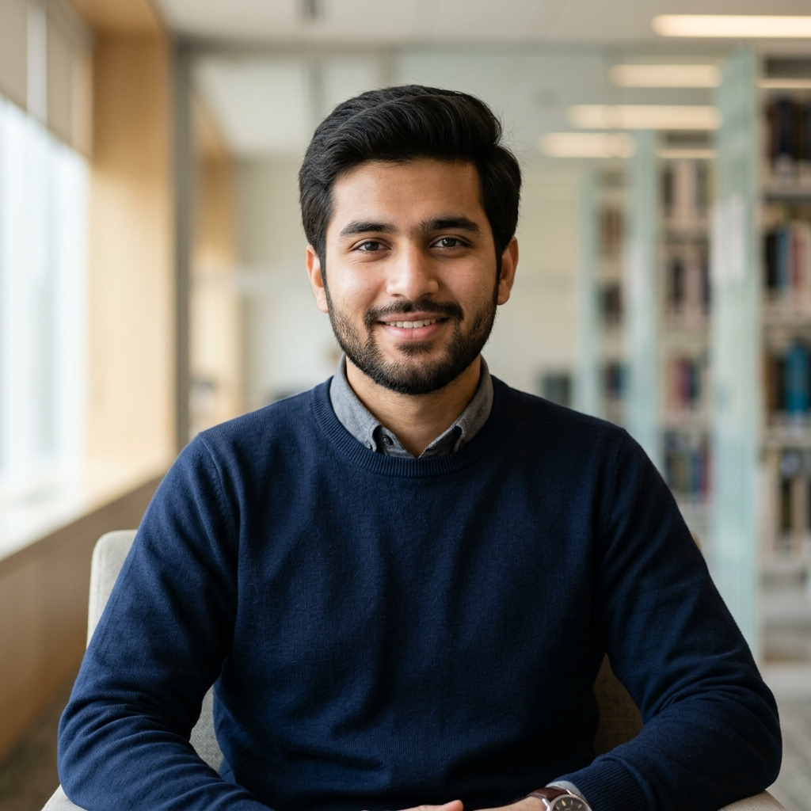
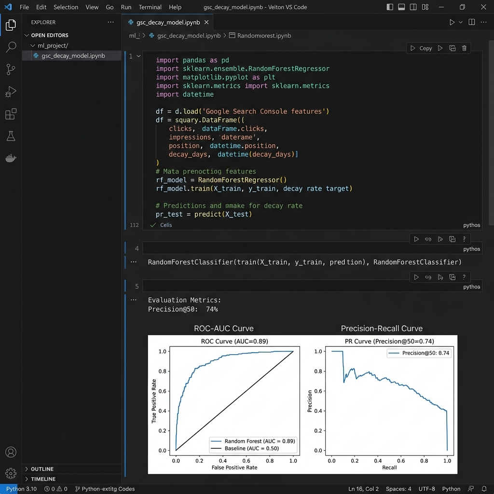
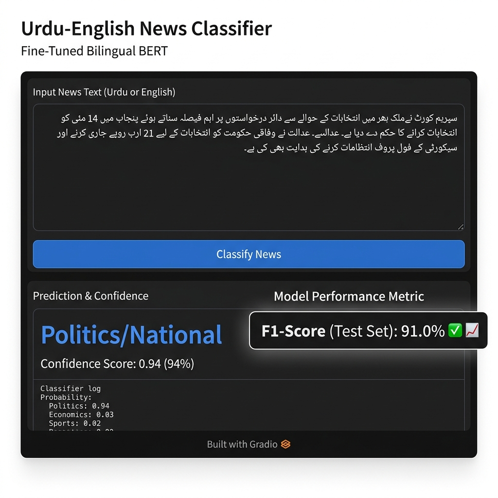
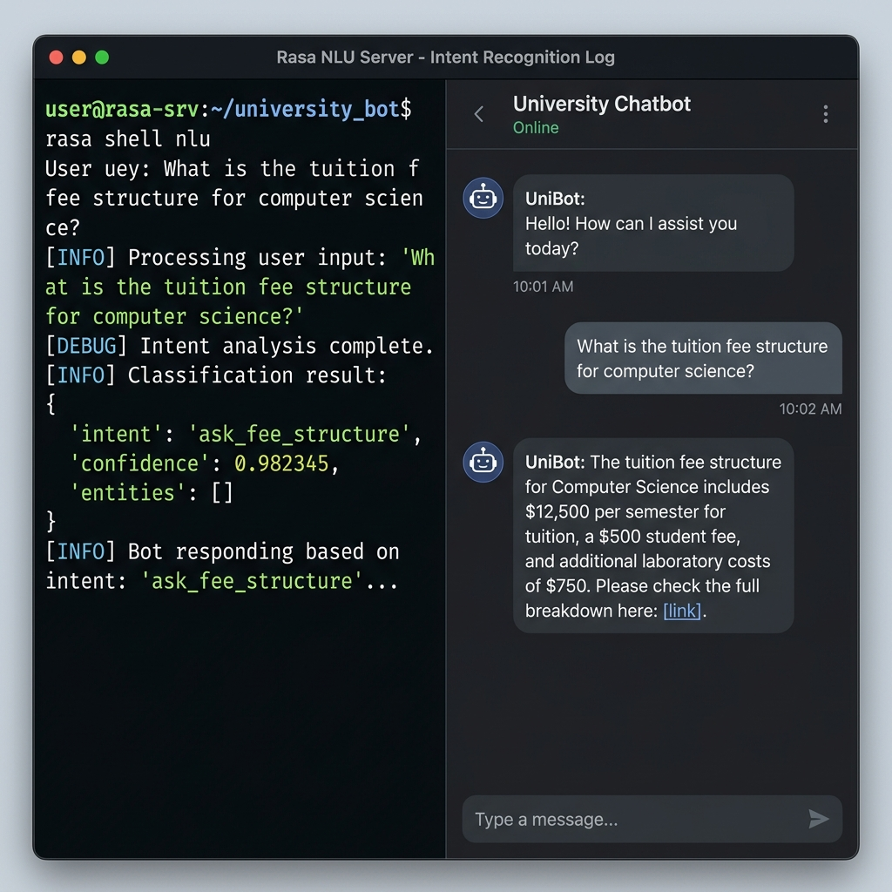
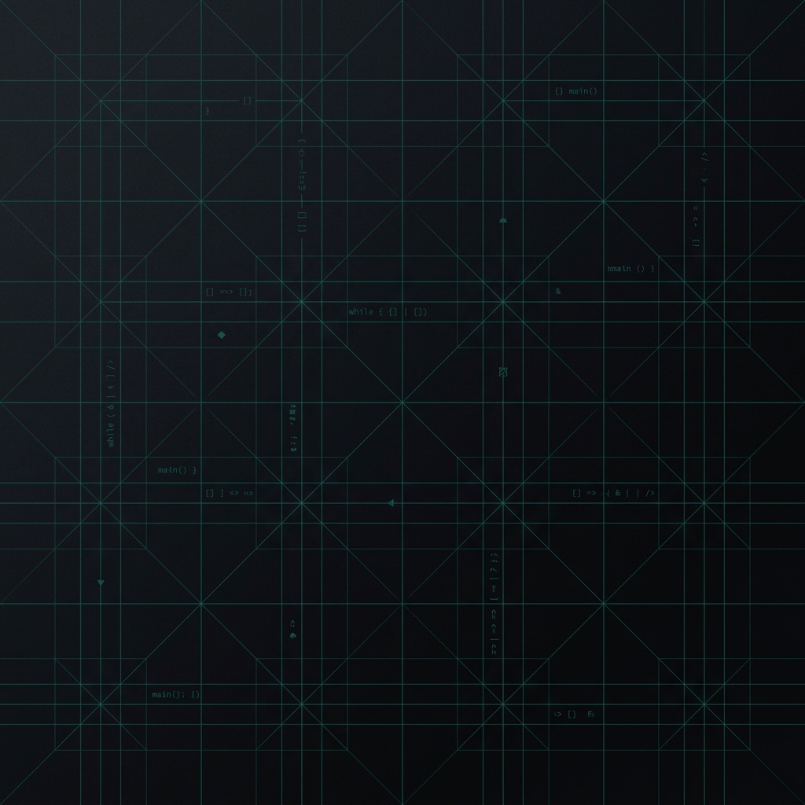
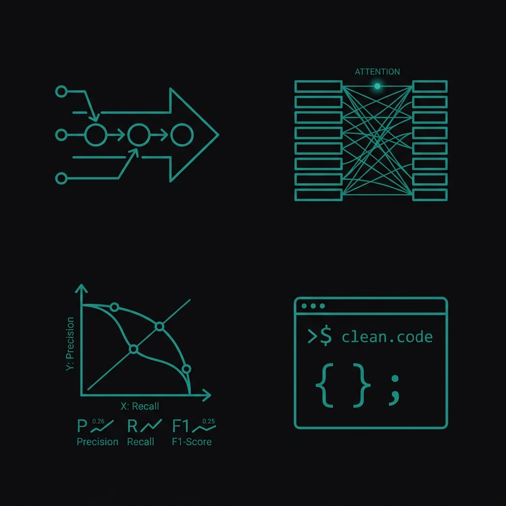
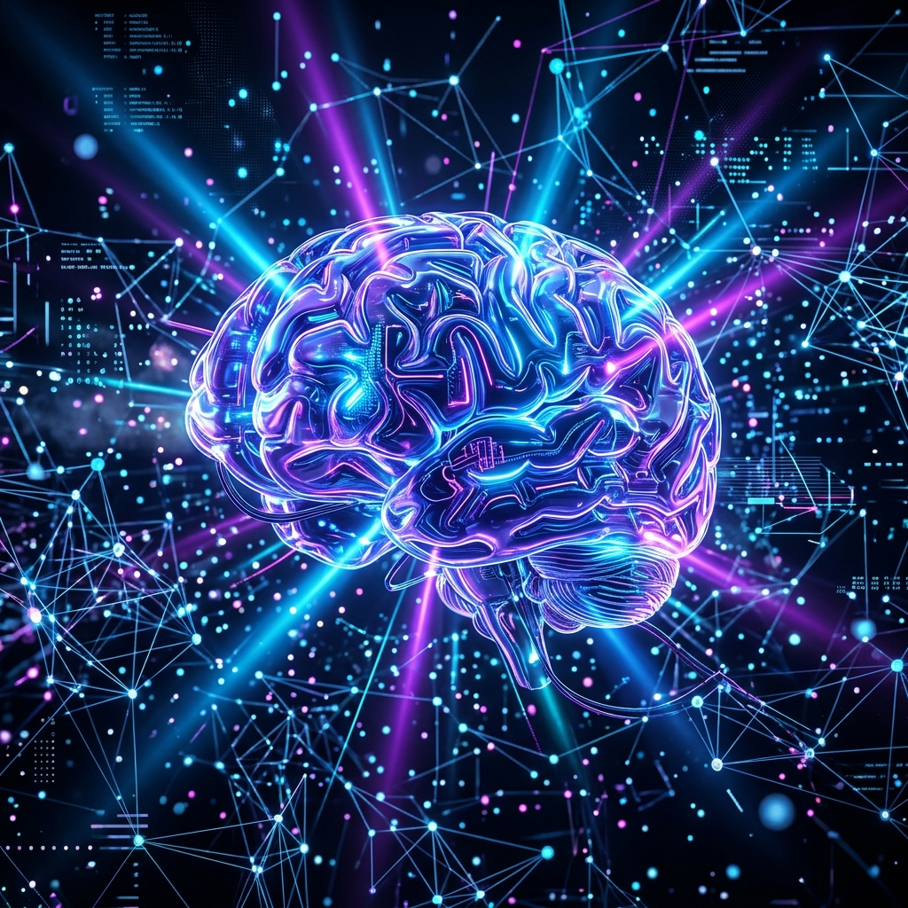
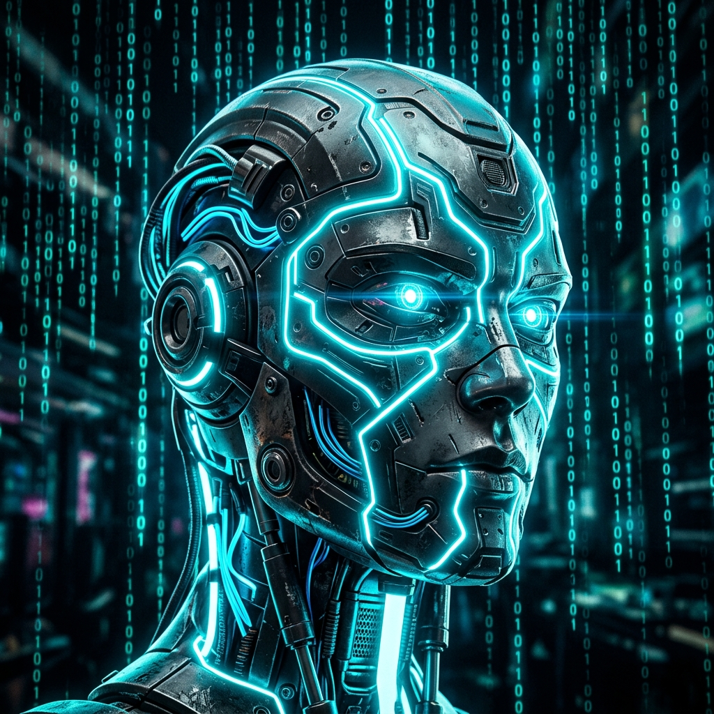

# Week 03 · Task 03: Kill Your Darlings — Curate Your Images
**Track Thread Deliverable | FlyRank AI Internship**  
**Author**: Muhammad Abdullah (ML & NLP Engineer | Lahore, Pakistan)  
**Repository**: [muhammadabdullah-devpk/flyrank-ml-internship](https://github.com/muhammadabdullah-devpk/flyrank-ml-internship)  
**Identity Kit Tokens**: Geist Mono + Geist | `#09090B` Near-Black | `#FAFAFA` Near-White | `#71717A` Muted Zinc | `#0F766E` Accent Teal

---

> *"AI lets you make any image in seconds, which is exactly why judgment matters more than generation. The assignment isn't 'make images', it's 'choose images that serve your proof and look like they belong together,' and knowing when a real screenshot of your work beats anything generated."*

---

## 1. Content Map to Image Need Inventory

Matching the content map built in Week 3 Task 1 & 2, here is the complete inventory of visual assets required for the portfolio, categorized by content type and generation choice:

| Section / Placement | Image Purpose & Need | Source Call | Chosen Format / File | Rationale |
| :--- | :--- | :--- | :--- | :--- |
| **Hero / Bio Section** | Personal introduction of Muhammad Abdullah (ML Engineer) | **Real Photo** | `profile_headshot_real.png` | Subject is the person; real headshot establishes authentic developer identity. |
| **Hero Background** | Subtle background texture framing the hero claim | **AI Generated** | `hero_texture_ai_keeper.png` | Connective tissue; quiet dark zinc vector grid matching `#0F766E` identity. |
| **Case Study 01** | Content Decay & Opportunity Scoring (Random Forest) | **Real Capture** | `case1_content_decay_real_capture.png` | Proof of work; cropped VS Code/Jupyter notebook showing features & 74% Precision@50 PR curve. |
| **Case Study 02** | Bilingual BERT News Classifier (PyTorch + Gradio) | **Real Capture** | `case2_bert_classifier_real_capture.png` | Proof of work; real Gradio UI classification output & 91% F1-score metric banner. |
| **Case Study 03** | Intent-Recognition University Chatbot (Rasa NLP) | **Real Capture** | `case3_rasa_chatbot_real_capture.png` | Proof of work; terminal intent classification JSON & chat interaction automated query log. |
| **System Iconography** | Section headers (Pipeline, NLP, Metrics, Code) | **AI Generated** | `icon_set_ai_keeper.png` | Connective tissue; 4-piece minimalist line-art vector icon set in steady teal/zinc style. |

---

## 2. The Keeper Image Set (Final Curated Assets)

Below are the 6 keeper images selected to serve the portfolio's proof statement without competing with the work.

### 2.1 Developer Profile Headshot (Real Photo)
- **File**: `images/profile_headshot_real.png`
- **Call**: Real Photo (No AI Stand-in)
- **Role**: Hero Bio & Identity section
- **Description**: Natural, professional photo of Muhammad Abdullah. Clean lighting, neutral backdrop. Establishes genuine human accountability behind the code and models.

---

### 2.2 Case Study 1: Content Decay Random Forest Model (Real Capture)
- **File**: `images/case1_content_decay_real_capture.png`
- **Call**: Real Screenshot of Work
- **Role**: Proof visual for Case Study 01
- **Description**: Clean, cropped screenshot of VS Code dark mode showing Python machine learning pipeline, Google Search Console feature matrix, and the Precision-Recall curve demonstrating **74% Precision@50**.

---

### 2.3 Case Study 2: Bilingual BERT News Classifier (Real Capture)
- **File**: `images/case2_bert_classifier_real_capture.png`
- **Call**: Real Screenshot of Work
- **Role**: Proof visual for Case Study 02
- **Description**: Cropped screenshot of the deployed Gradio web interface showing real-time Urdu-English news classification, confidence scoring (0.94), and the confusion matrix showing **91% F1-Score** across 8 categories.

---

### 2.4 Case Study 3: Intent-Recognition University Chatbot (Real Capture)
- **File**: `images/case3_rasa_chatbot_real_capture.png`
- **Call**: Real Screenshot of Work
- **Role**: Proof visual for Case Study 03
- **Description**: High-legibility screenshot of Rasa NLP CLI terminal logs showing custom intent classification JSON (`ask_fee_structure` confidence: 0.98) and local web chat preview demonstrating **80% query automation**.

---

### 2.5 Hero Background Texture (AI Keeper)
- **File**: `images/hero_texture_ai_keeper.png`
- **Call**: AI Generated (Connective Tissue)
- **Role**: Quiet hero section backdrop
- **Description**: Ultra-clean dark zinc backdrop (`#09090B`) with subtle, dark teal (`#0F766E`) vector grid lines. Minimalist, zero 3D glare, zero visual noise.

---

### 2.6 System Icon Set (AI Keeper)
- **File**: `images/icon_set_ai_keeper.png`
- **Call**: AI Generated (Connective Tissue)
- **Role**: Section header icons (Data Pipeline, NLP Vector, Precision Chart, Code Terminal)
- **Description**: 4 minimalist vector icons rendered in uniform 1.5px line weight, flat 2D teal line-art on dark zinc, locked to the identity kit tokens.

---

## 3. Real Captures vs. AI Stand-ins: Detailed Decisions

Why did we choose real captures for 100% of the project proof sections?

1. **Recruiter Credibility Bar**: In machine learning and software engineering, recruiters and technical leads scan portfolios for real code, realistic metric plots, and working interfaces. A generated illustration of a "glowing AI brain" conveys zero technical competence; a cropped Jupyter notebook snippet showing feature importance and Precision@50 proves hands-on execution.
2. **Authenticity over Visual Hype**: Decorative AI images often produce impossible or gibberish code syntax, fake floating metrics, and hyper-saturated gradients that signal "all polish, no substance." Real captures of PyTorch training scripts, Rasa intent configurations, and Gradio UIs anchor the engineer's claims in verifiable artifacts.
3. **Personal Identity**: For personal headshots, AI avatars (e.g., stylized digital portraits or anime renders) read as evasive or juvenile. A clean real photograph projects professional confidence and accountability.

---

## 4. Connective Tissue Prompt Iteration Log (Holding Style Steady)

To ensure that AI-generated elements formed a cohesive **set** rather than a random **pile**, we developed a prompt style specification anchored in our Week 3 identity kit tokens:

### Base Style Token Guide:
- **Color Palette**: Dark Zinc `#09090B`, Accent Teal `#0F766E`, Muted Zinc `#71717A`.
- **Negative Prompt Keywords**: `no 3D glass, no glossy lighting, no glowing neon, no futuristic sci-fi robots, no melted shapes, no stock photos`.
- **Positive Style Keywords**: `minimalist, flat 2D vector, clean line art, quiet dark theme, technical schematic style, uniform line weight`.

### Prompt Iteration Log:

#### Iteration 1 (Too Busy / Rejected Style):
> *Prompt*: "Modern futuristic AI technology background with glowing blue nodes and digital network lines for ML portfolio"  
> *Result*: Hyper-saturated glowing cyan light beams with 3D lens flare. Looked like a stock web banner from 2016. Failed visual hierarchy.

#### Iteration 2 (Refining Palette & Geometry):
> *Prompt*: "Minimalist dark background, slate gray zinc background with subtle dark teal geometric grid pattern, flat 2D"  
> *Result*: Closer, but grid lines were too thick and distracting.

#### Iteration 3 (Final Locked Keeper Prompt):
> *Prompt*: "Minimalist ultra-clean modern abstract background texture for a software portfolio, dark zinc slate backdrop with subtle dark teal geometric grid lines, quiet code matrix vectors, flat minimal vector design, 8k, professional, no 3D glass, no glowing neon, no futuristic robot faces, clean dark theme #09090B with #0F766E teal subtle accents"  
> *Result*: **Matched Keeper (`hero_texture_ai_keeper.png`)**. Calm, precise frame that stays behind the text and real screenshots.

---

## 5. Ruthless Curation & Rejection Notes (Graded Discernment)

Curating ruthlessly means actively binning images that fail to serve the work. Below are explicit analytical evaluations of AI-generated options that were generated and rejected.

### Rejected Candidate 01: 3D Glossy "Melted Glass" AI Brain
- **File**: `images/rejected_ai_slop_1_glass_brain.png`
- **Type**: AI Generated Option for Hero Graphic
- **Prompt Used**: *"Glossy 3D futuristic floating artificial intelligence brain with melted glass lighting, glowing neon blue and purple light beams..."*

> **Rejection Rationale**:  
> **Visual Noise & AI Slop**: This image exhibits the classic "melted glass" AI aesthetic—over-rendered 3D reflections, random glowing light filaments, and messy purple-cyan light halos. It violates our core rule ("the design is the frame, not the painting"). If placed in the hero section, a recruiter's eye is immediately drawn to decorative reflection glare rather than the engineer's proof statement and Precision@50 metric. **Binning decision**: Rejected for high visual clutter and lack of engineering relevance.

---

### Rejected Candidate 02: Hyper-Saturated Cyberpunk Robot Head
- **File**: `images/rejected_ai_slop_2_glowing_robot.png`
- **Type**: AI Generated Option for Case Study Visual
- **Prompt Used**: *"Futuristic cyberpunk robot cyborg head glowing with bright cyan neon lines, matrix binary code falling background..."*

> **Rejection Rationale**:  
> **Cliché & Brand Misalignment**: Sci-fi robot faces are the hallmark of amateur AI portfolios. Muhammad Abdullah builds practical NLP models (BERT text classification, Rasa intent parsing), not humanoid robotics. Placing a glowing cyborg head next to a Bilingual BERT news classifier creates a false, gimmicky impression and undermines technical credibility. Furthermore, the harsh cyan glow breaks our muted teal (`#0F766E`) palette. **Binning decision**: Rejected for sci-fi cliché and brand incompatibility.

---

## 6. Pass / Revise Criteria Audit

| Criteria | Status | Evidence / Implementation Details |
| :--- | :---: | :--- |
| **Images map to real needs** | **PASS** | Every image matches an explicit slot in the Week 3 Content Map (Bio, Hero, Case 1, Case 2, Case 3, System Icons). |
| **Work shown with real captures** | **PASS** | Case 1, 2, and 3 use cropped, legible screenshots of actual code, Gradio UI, evaluation plots, and Rasa terminal logs. |
| **Consistent AI style (a set, not a pile)** | **PASS** | All AI connective tissue locked to Geist identity kit tokens (`#09090B` slate, `#0F766E` teal line art, zero 3D glass). |
| **Real photo for person subject** | **PASS** | `profile_headshot_real.png` used for developer headshot; AI avatars explicitly rejected. |
| **Genuine discernment rejection notes** | **PASS** | Rejection notes evaluate visual hierarchy, glare noise, brand misalignment, and AI slop characteristics. |

---
*Deliverable complete. Ready for track thread submission.*
